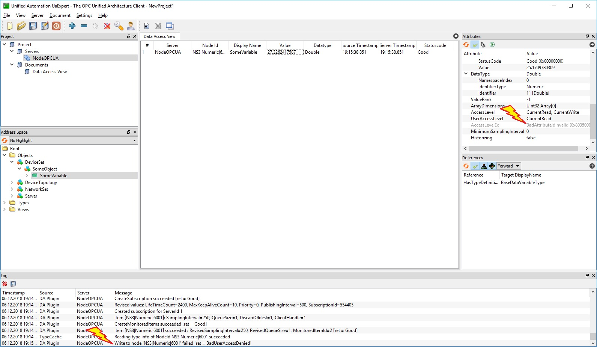

# What is this?

A [short, self contained and correct (compilable) example](http://sscce.org/) for an issue.

# What is this trying to show?

TODO: add link to isse



# Installation

```
git clone https://github.com/num-lock/node-opcua-permission-issue.git
cd node-opcua-permission-issue
```

followed by

```
yarn install
```

or

```
npm install
```

# Getting started

```
yarn run start
```

or

```
npm run start
```